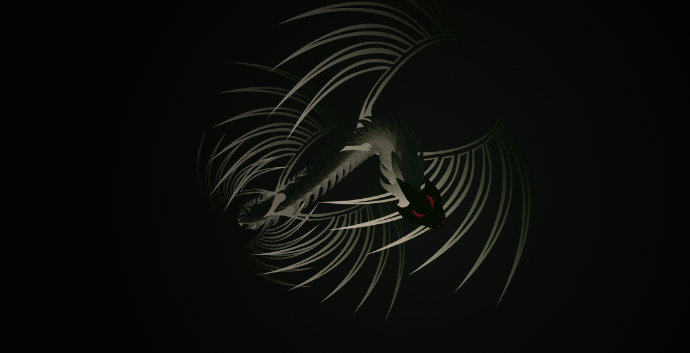

# Animated Dragon
An interactive SVG-based animated dragon that follows the user’s cursor with smooth procedural motion, dynamic color effects, and real-time wing-flutter audio using JavaScript.

**Live Website:** [https://kethnulee-weerasinghe4.github.io/Animated-Dragon/](https://kethnulee-weerasinghe4.github.io/Animated-Dragon/)



## Overview

Animated Dragon is an interactive SVG-based animation where a mythical dragon smoothly follows the user’s cursor with fluid, organic motion. The project combines procedural animation, dynamic color shifting, and real-time audio synthesis to create an immersive and responsive visual experience.

The dragon is built from reusable SVG segments and animated using custom physics-style logic, giving it a natural “living creature” feel rather than a simple path-follow effect.

## Key Features

- Procedural dragon body built from SVG <defs> and <use> elements
- Smooth cursor-following with spring-like motion
- Dynamic color shifting along the body
- Wing-flutter sound effects generated with the Web Audio API
- Idle “breathing” motion for lifelike presence
- Cinematic background with vignette and scanline overlay
- Mouse and touch support (pointer events)

## Tech Stack

- HTML
- CSS
- JavaScript
- SVG
- Web Audio API
  
## Getting Started

### Installation

```bash
git clone https://github.com/Kethnulee-Weerasinghe4/Animated-Dragon.git
cd Animated-Dragon


